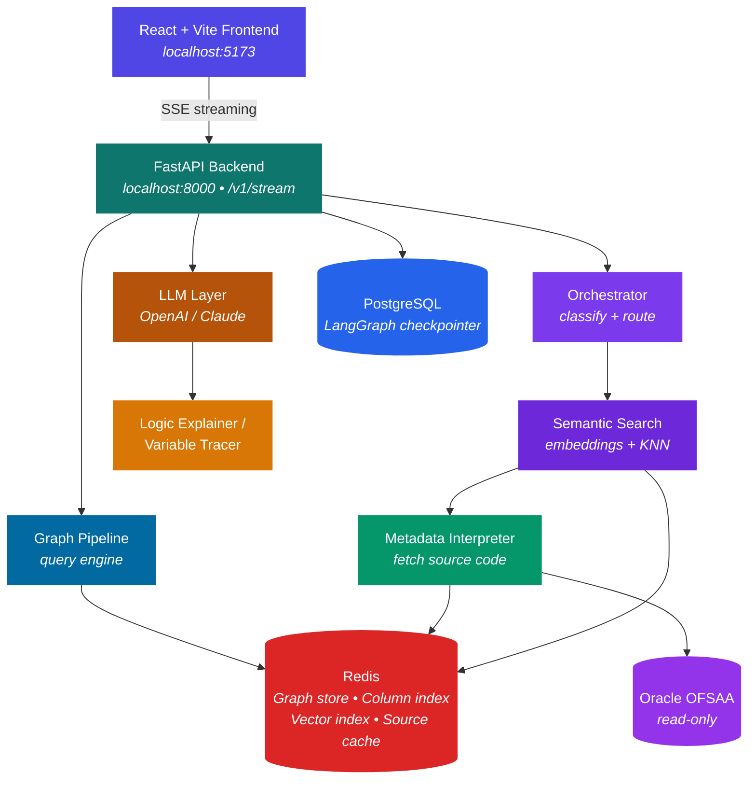
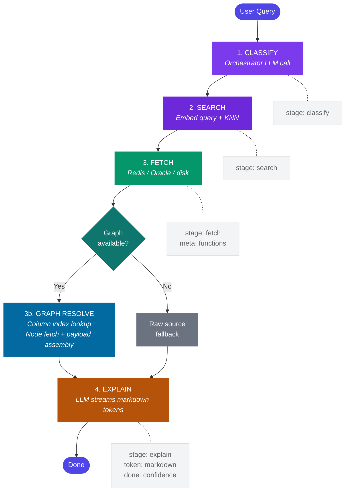
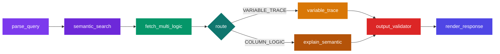
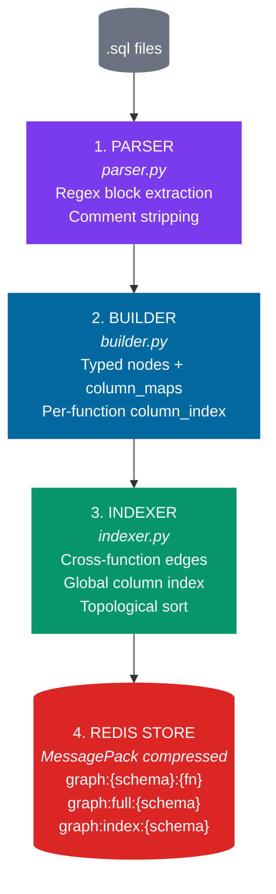
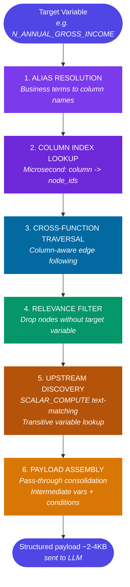
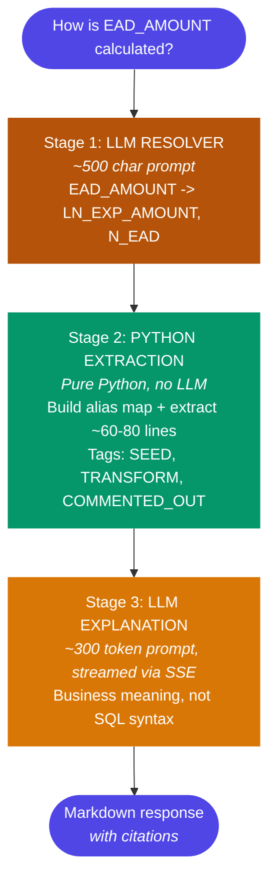

# RTIE — Regulatory Trace & Intelligence Engine

RTIE is a read-only multi-agent AI system built on Oracle OFSAA FSAPPS that explains the complete logic behind regulatory capital computations — tracing PL/SQL functions, column lineage, and data flows to give engineers instant, fully cited answers without touching the underlying system.

---

## Prerequisites

- **Python 3.11+** — required runtime
- **Docker & Docker Compose** — for Redis Stack (with RediSearch) and PostgreSQL
- **Oracle Database** — access to an OFSAA FSAPPS instance (read-only credentials)
- **OpenAI API Key** — for query classification, embeddings, indexing, and explanations
- **LangSmith Account** — for observability and tracing (optional)

---

## Quick Start

### 1. Clone the repository
```bash
git clone <repository-url>
cd RTIE
```

### 2. Start infrastructure
```bash
docker-compose up -d
```
This starts **Redis Stack** (port 6379 — includes RediSearch for vector search) and **PostgreSQL** (port 5432).

### 3. Configure environment
Copy `.env.dev` and set your credentials:
```
OPENAI_API_KEY=your_openai_key
OPENAI_MODEL=gpt-4o-mini
ORACLE_HOST=localhost
ORACLE_PORT=1521
ORACLE_SID=XE
ORACLE_USER=OFSMDM
ORACLE_PASSWORD=your_password
```

### 4. Install Python dependencies
```bash
pip install poetry
poetry install
```
Or install directly:
```bash
pip install -r requirements.txt
```

### 5. Place your PL/SQL source files
Put `.sql` files in `db/modules/<MODULE_NAME>/functions/`:
```
db/modules/OFSDMINFO_ABL_DATA_PREPARATION/
  functions/
    FN_LOAD_OPS_RISK_DATA.sql
    POPULATE_PP_FROMGL.sql
    TLX_LOB_MAPPING.sql
    ...
```

### 6. Index functions (one-time)
```bash
python cli.py index --force
```
This generates descriptions (via OpenAI gpt-4o-mini) and embeddings for each function, stored in Redis.

### 7. Ask questions via CLI
```bash
python cli.py ask "How is N_ANNUAL_GROSS_INCOME calculated?"
python cli.py ask "What updates STG_PRODUCT_PROCESSOR?"
python cli.py ask "Explain FN_LOAD_OPS_RISK_DATA"
python cli.py ask "Trace EAD_AMOUNT across functions"
```

### 8. Run the web app
```bash
# Terminal 1: Backend
python run.py

# Terminal 2: Frontend
cd frontend
npm install
npm run dev
```
Open http://localhost:5173

---

## Project Structure

```
RTIE/
  config/                    Settings (YAML)
  db/
    modules/                 PL/SQL source files (.sql)
    schemas/                 Oracle DDL (OFSMDM, OFSERM)
  src/
    agents/                  LangGraph agents
      orchestrator.py          Query classification + routing
      logic_explainer.py       LLM-powered explanation generation
      variable_tracer.py       Variable lineage tracing (LLM + Python hybrid)
      metadata_interpreter.py  Source code fetching (Redis/Oracle/disk)
      validator.py             Output validation + confidence scoring
      renderer.py              Final response assembly
      cache_manager.py         Cache slash commands
      indexer.py               Vector index builder (OpenAI embeddings)
    parsing/                 PL/SQL graph parser (pure Python, no LLM)
      parser.py                Regex-based block extractor
      builder.py               Typed node + calculation builder
      indexer.py               Cross-function graph + column index
      serializer.py            JSON + MessagePack serialization
      store.py                 Redis graph storage
      loader.py                Startup pipeline orchestrator
      query_engine.py          Query-time subgraph filtering
    pipeline/                LangGraph orchestration
      logic_graph.py           StateGraph definition + conditional edges
      state.py                 LogicState TypedDict
    tools/                   Infrastructure clients
      cache_tools.py           Redis cache client
      schema_tools.py          Oracle query executor
      sql_guardian.py          SQL injection prevention
      vector_store.py          Redis vector search (RediSearch)
    middleware/               Correlation ID, retry
    monitoring/               Health checks
  tests/unit/parsing/        44 unit tests for the graph parser
  frontend/                  React + Vite web UI
  cli.py                     CLI testing tool
  run.py                     Backend launcher (Windows-compatible)
```

---

## Architecture

### High-Level System Overview



### LLM Provider

All LLM calls use **OpenAI gpt-4o-mini** by default. Anthropic Claude is also supported -- switch from the frontend model selector dropdown. Classification and embeddings use small payloads (<2KB); source analysis uses the graph pipeline payload (~2-4KB).

---

### Request Pipeline (SSE Streaming)

When a user asks a question, the `/v1/stream` endpoint processes it through 4 stages, streaming Server-Sent Events (SSE) to the frontend at each stage:



**Routing logic at Stage 4:**
- If graph pipeline produced `llm_payload` -- `stream_semantic()` with structured payload
- Else if `VARIABLE_TRACE` -- Variable Tracer (3-stage extraction pipeline)
- Else -- `stream_semantic()` with raw source fallback

### LangGraph StateGraph (7 nodes, conditional routing)

The `/v1/query` (non-streaming) endpoint uses a compiled LangGraph pipeline with PostgreSQL checkpointing:



| Node | Agent | Purpose |
|------|-------|---------|
| parse_query | Orchestrator | Classify query type, extract search terms |
| semantic_search | Embeddings + VectorStore | KNN lookup for relevant functions |
| fetch_multi_logic | MetadataInterpreter | Fetch source from Redis/Oracle/disk |
| variable_trace | VariableTracer | 3-stage variable lineage pipeline |
| explain_semantic | LogicExplainer | Cross-function explanation with citations |
| output_validator | Validator | Verify referenced functions, compute confidence |
| render_response | Renderer | Assemble final response with badges and warnings |

---

### Graph Parsing Pipeline (Startup)

On application startup, the graph pipeline parses all `.sql` files into structured JSON graphs stored in Redis:



**Node types:** INSERT, UPDATE, MERGE, DELETE, SCALAR_COMPUTE, WHILE_LOOP, FOR_LOOP, SELECT_INTO

**Calculation types:** DIRECT, ARITHMETIC, CONDITIONAL, FALLBACK, OVERRIDE

---

### Query Engine Pipeline (Query-Time)

When the graph is available, the query engine resolves a user question to a compact structured payload in microseconds -- replacing ~17,000 tokens of raw PL/SQL with a ~2-4KB focused payload:



**Example output structure (4 steps instead of raw 500+ lines):**
```
Step 1: INSERT seed from ABL_OPS_RISK_DATA into STG_OPS_RISK_DATA
Step 2: UPDATE CBA/RBA with CASE expression (intermediate vars: TOT1, CBA_DEDUCTION)
Step 3: UPDATE ABLIBG with CASE expression
Step 4: [PASS-THROUGH] TLX_OPS_ADJ_MISDATE -- copies value unchanged through staging table
```

---

### Variable Tracer (3-Stage Pipeline)

When a user asks "How is EAD_AMOUNT calculated?" and the graph pipeline has no matches, the Variable Tracer extracts relevant lines using a hybrid LLM + Python approach:



---

### Frontend Architecture

```
React + Vite + Tailwind CSS v4
    |
    +-- App.jsx              Main app with model selector
    +-- pages/Chat.jsx       Chat interface, auto-scroll control
    +-- components/
    |     MessageBubble.jsx  User messages (edit, retry, copy)
    |     |                  Assistant messages (streaming markdown)
    |     |                  AgentThinking (4-stage pipeline indicator)
    |     |                  CodeBlockWithCopy (syntax highlighted)
    |     ResponseCard.jsx   Structured response cards
    |     CommandResult.jsx  Slash command output
    +-- api/client.js        SSE streaming via fetch + ReadableStream
```

**SSE event flow:**
```
event: stage  -> Updates pipeline stage indicator (classify/search/fetch/explain)
event: meta   -> Populates function list and metadata
event: token  -> Appends to streaming markdown (rendered incrementally)
event: done   -> Final metadata (confidence, citations, badge)
event: error  -> Error display
```

---

## CLI Reference

| Command | Description |
|---------|-------------|
| `python cli.py index` | Index all modules (skips unchanged functions) |
| `python cli.py index --force` | Re-index all functions |
| `python cli.py status` | Show index stats and indexed function names |
| `python cli.py ask "question"` | Ask any question about the PL/SQL codebase |

---

## Slash Commands (Web UI)

| Command | Description |
|---------|-------------|
| `/refresh-cache <name>` | Refresh one object's source cache |
| `/refresh-cache-all` | Re-sync all functions for the schema |
| `/cache-status <name>` | Show cache timestamps and version hash |
| `/cache-list` | List all cached keys |
| `/cache-clear <name>` | Delete one cache entry |
| `/refresh-schema` | Detect Oracle DDL changes and sync |
| `/index-module <name> [--force]` | Index one module's functions |
| `/index-all [--force]` | Index all modules |
| `/index-status` | Show vector index statistics |

---

## How to Add a New Module

1. Create a directory under `db/modules/`:
   ```
   db/modules/YOUR_MODULE_NAME/
     functions/
       FN_YOUR_FUNCTION.sql
       SP_YOUR_PROCEDURE.sql
   ```

2. Index it:
   ```bash
   python cli.py index --force
   ```

3. Ask questions about it immediately.

---

## Environment Variables

| Variable | Description | Default |
|----------|-------------|---------|
| `OPENAI_API_KEY` | OpenAI API key | (required) |
| `OPENAI_MODEL` | Default OpenAI model | `gpt-4o-mini` |
| `ANTHROPIC_API_KEY` | Anthropic Claude API key | (optional) |
| `ANTHROPIC_MODEL` | Default Claude model | `claude-sonnet-4-20250514` |
| `DEFAULT_LLM_PROVIDER` | Default provider (`openai` or `anthropic`) | `openai` |
| `ORACLE_HOST` | Oracle database hostname | `localhost` |
| `ORACLE_PORT` | Oracle listener port | `1521` |
| `ORACLE_SID` | Oracle System Identifier | `XE` |
| `ORACLE_USER` | Oracle username (read-only) | `OFSMDM` |
| `ORACLE_PASSWORD` | Oracle password | (required) |
| `REDIS_HOST` | Redis server hostname | `localhost` |
| `REDIS_PORT` | Redis server port | `6379` |
| `POSTGRES_HOST` | PostgreSQL hostname | `localhost` |
| `POSTGRES_PORT` | PostgreSQL port | `5432` |
| `POSTGRES_DB` | PostgreSQL database name | `rtie` |
| `POSTGRES_USER` | PostgreSQL username | `postgres` |
| `POSTGRES_PASSWORD` | PostgreSQL password | (required) |
| `EMBEDDING_MODEL` | OpenAI embedding model | `text-embedding-3-small` |
| `ENVIRONMENT` | Runtime environment | `dev` |

---

## Running Tests

```bash
python -m pytest tests/unit/parsing/ -v
```

44 tests covering: parser, builder, indexer, serializer, store, loader, query engine.
