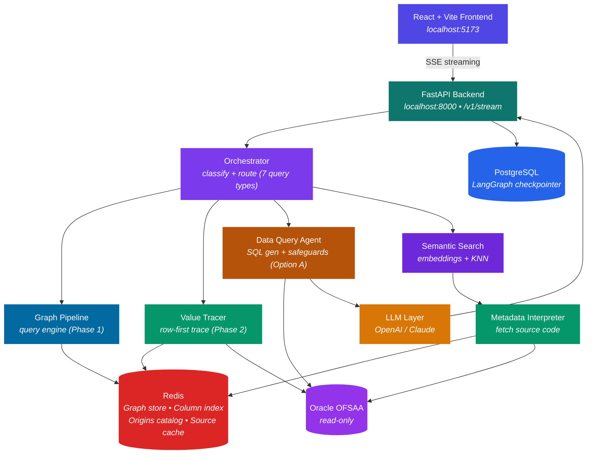
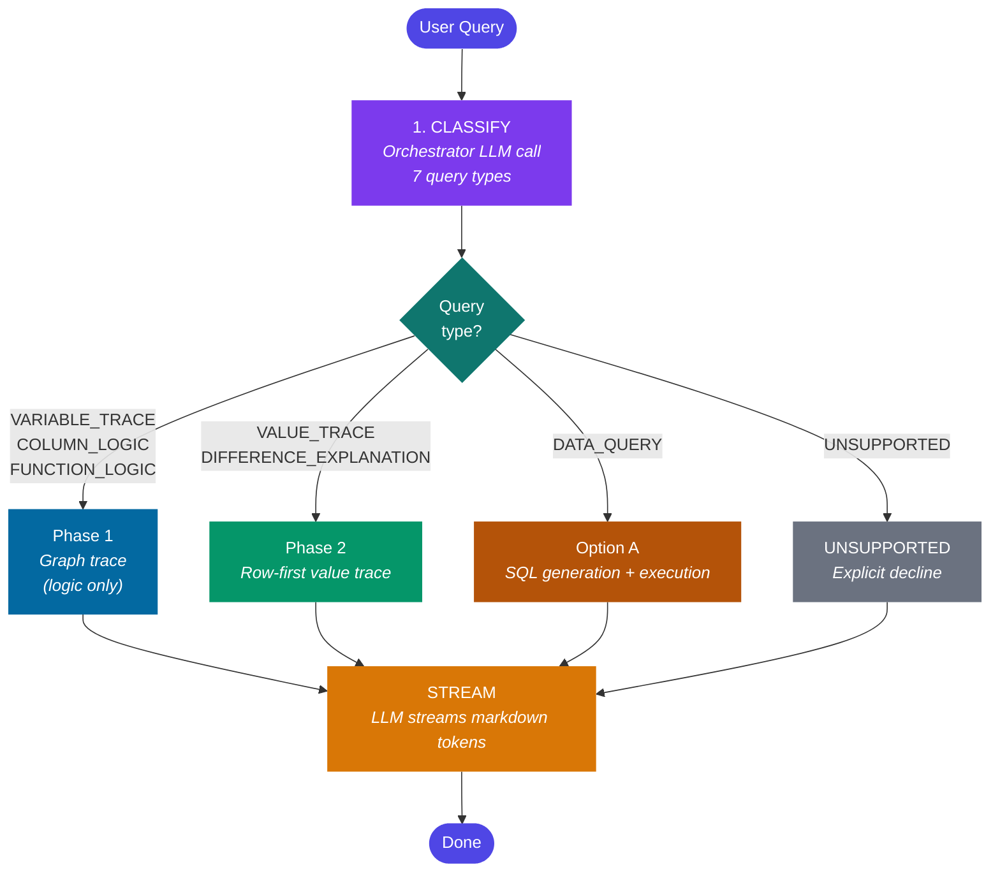
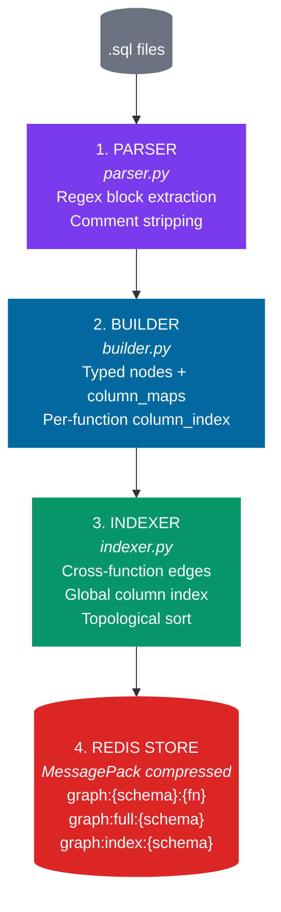
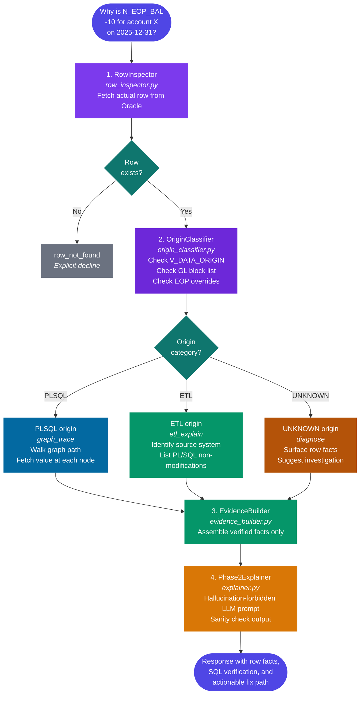
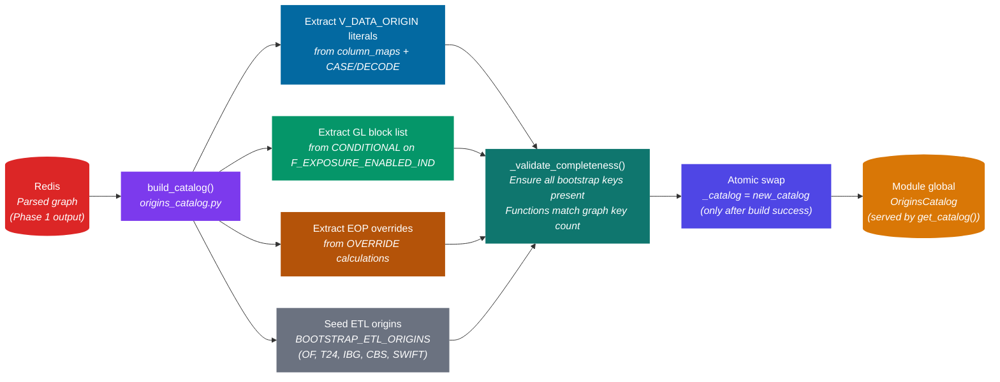
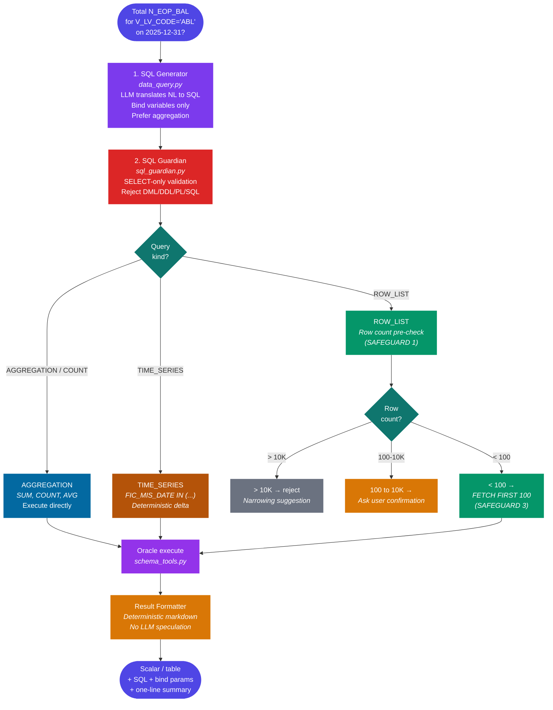

# RTIE — Regulatory Trace & Intelligence Engine

> **Explain every number. Trace every transformation. Touch nothing.**

RTIE is a read-only multi-agent AI system built on Oracle OFSAA FSAPPS that explains the complete logic behind regulatory capital computations — tracing PL/SQL functions, column lineage, and actual data values to give engineers instant, fully cited answers without touching the underlying system.

---

## How It Works

An engineer asks a question — "How is N_ANNUAL_GROSS_INCOME calculated?" or "Why is N_EOP_BAL showing -10 for account X?" — and RTIE answers from one of three capabilities:

- **Logic trace** explains what the code does using a compressed graph representation (86.6% smaller than raw PL/SQL source).
- **Value trace** fetches the actual row, classifies its origin, and explains how the value came to be — using graph path for PL/SQL-computed values and the origins catalog for ETL-loaded values.
- **Data query** generates, validates, and executes a read-only SELECT against Oracle for aggregation, filter, count, and time-series questions.

Every answer is grounded in parsed code or fetched data. No speculation. No hallucinated function names. When a question falls outside RTIE's scope (cross-table reconciliation, forecasting, tables not in the graph), it declines explicitly rather than guessing.

---

## Sample Outputs

**Logic query:** *"How is N_ANNUAL_GROSS_INCOME calculated?"*

> **Execution Condition:** This entire function ONLY runs when the reporting month is December.
>
> **Step 1: Initial Insert** (FN_LOAD_OPS_RISK_DATA, lines 203-222)
> Data is inserted from ABL_OPS_RISK_DATA into STG_OPS_RISK_DATA. The base value is typed in manually via Excel upload and loaded as-is.
>
> **Step 2: CBA/RBA Deduction Adjustment** (FN_LOAD_OPS_RISK_DATA, lines 309-324)
> N_ANNUAL_GROSS_INCOME is adjusted using TOT1 + CBA_DEDUCTION for CBA, and LN_DEDUCITON_RATIO_1 for RBA.
> *Intermediate variables: TOT1 = LN_TOTAL_DEDUCT + (-1 × LN_DEDUCITON_RATIO_1), CBA_DEDUCTION = SUM(N_AMOUNT_ACY) from 3 specific GL codes*
>
> **Step 3: ABLIBG Adjustment** (FN_LOAD_OPS_RISK_DATA, lines 329-344)
> Same deduction logic applied separately for the ABLIBG entity.
>
> **Step 4: Pass-Through** (TLX_OPS_ADJ_MISDATE)
> Copies N_ANNUAL_GROSS_INCOME unchanged through STG_OPS_ADJ_MISDATE_TLX and back. Purpose: date-adjusts historical records.

**Value query:** *"Why is N_EOP_BAL -10 for account TF1528012748-T24-COLLBLG on 2025-12-31?"*

> The value of the row for N_EOP_BAL is -10.0. This row was loaded by the T24 core banking system. No PL/SQL function computed the N_EOP_BAL value. PL/SQL modified the F_EXPOSURE_ENABLED_IND column, setting it to 'N' because the GL code is on the hardcoded block list. The fix path is: Investigate T24 extract logs, verify GL position.

**Data query:** *"What is the total N_EOP_BAL for all accounts with V_LV_CODE='ABL' on 2025-12-31?"*

> **Summary:** SUM(N_EOP_BAL) = -1,611,100,157.21.
> **SQL executed:** `SELECT SUM(N_EOP_BAL) FROM STG_PRODUCT_PROCESSOR WHERE FIC_MIS_DATE = TO_DATE(:mis_date, 'YYYY-MM-DD') AND V_LV_CODE = :lv_code`

---

## Prerequisites

- **Python 3.11+** — required runtime
- **Docker & Docker Compose** — for Redis Stack (with RediSearch) and PostgreSQL
- **Oracle Database** — access to an OFSAA FSAPPS instance (read-only credentials)
- **OpenAI API Key** — for query classification, embeddings, indexing, and explanations
- **LangSmith Account** — for observability and tracing (optional)

---

## Quick Start

### 1. Clone the repository
```bash
git clone <repository-url>
cd RTIE
```

### 2. Start infrastructure
```bash
docker-compose up -d
```
This starts **Redis Stack** (port 6379 — includes RediSearch for vector search) and **PostgreSQL** (port 5432).

### 3. Configure environment
Copy `.env.dev` and set your credentials:
```
OPENAI_API_KEY=your_openai_key
OPENAI_MODEL=gpt-4o-mini
ORACLE_HOST=localhost
ORACLE_PORT=1521
ORACLE_SID=XE
ORACLE_USER=OFSMDM
ORACLE_PASSWORD=your_password
```

### 4. Install Python dependencies
```bash
pip install poetry
poetry install
```
Or install directly:
```bash
pip install -r requirements.txt
```

### 5. Place your PL/SQL source files
Put `.sql` files in `db/modules/<MODULE_NAME>/functions/`:
```
db/modules/OFSDMINFO_ABL_DATA_PREPARATION/
  functions/
    FN_LOAD_OPS_RISK_DATA.sql
    POPULATE_PP_FROMGL.sql
    TLX_LOB_MAPPING.sql
    ...
```

### 6. Index functions (one-time)
```bash
python cli.py index --force
```
This generates descriptions (via OpenAI gpt-4o-mini) and embeddings for each function, stored in Redis.

### 7. Ask questions via CLI
```bash
python cli.py ask "How is N_ANNUAL_GROSS_INCOME calculated?"
python cli.py ask "Why is N_EOP_BAL -10 for account X on 2025-12-31?"
python cli.py ask "What is the total N_EOP_BAL for V_LV_CODE='ABL' on 2025-12-31?"
```

### 8. Run the web app
```bash
# Terminal 1: Backend
python run.py

# Terminal 2: Frontend
cd frontend
npm install
npm run dev
```
Open http://localhost:5173

---

## Project Structure

```
RTIE/
  config/                    Settings (YAML)
  db/
    modules/                 PL/SQL source files (.sql)
    schemas/                 Oracle DDL (OFSMDM, OFSERM)
  src/
    agents/                  LangGraph + Phase 2 agents
      orchestrator.py          Query classification + routing (7 query types)
      logic_explainer.py       LLM-powered logic explanation (Phase 1)
      variable_tracer.py       Variable lineage tracing (Phase 1 fallback)
      value_tracer.py          Row-first value trace (Phase 2)
      data_query.py            SQL generation + execution (Option A)
      metadata_interpreter.py  Source code fetching (Redis/Oracle/disk)
      validator.py             Output validation + confidence scoring
      renderer.py              Final response assembly
      cache_manager.py         Cache slash commands
      indexer.py               Vector index builder (OpenAI embeddings)
    parsing/                 PL/SQL graph parser (pure Python, no LLM)
      parser.py                Regex-based block extractor + comment stripping
      builder.py               Typed node + calculation builder
      indexer.py               Cross-function graph + column index
      serializer.py            JSON + MessagePack serialization
      store.py                 Redis graph storage
      loader.py                Startup pipeline orchestrator
      query_engine.py          Query-time subgraph filtering + payload assembly
    phase2/                  Phase 2 value lineage components
      row_inspector.py         Fetches the actual target row first
      origins_catalog.py       Graph-derived catalog (V_DATA_ORIGIN, GL blocks, overrides)
      origin_classifier.py     Routes PLSQL vs ETL vs UNKNOWN
      trace_router.py          Picks strategy by origin
      evidence_builder.py      Assembles verified facts only
      explainer.py             Hallucination-forbidden LLM prompts
    pipeline/                LangGraph orchestration
      logic_graph.py           StateGraph definition + conditional edges
      state.py                 LogicState TypedDict
    tools/                   Infrastructure clients
      cache_tools.py           Redis cache client
      schema_tools.py          Oracle query executor
      sql_guardian.py          SQL injection prevention (SELECT-only, bind vars)
      vector_store.py          Redis vector search (RediSearch)
    middleware/               Correlation ID, retry
    monitoring/               Health checks
  tests/unit/                50+ unit tests (parsing + phase2)
  frontend/                  React + Vite web UI
  cli.py                     CLI testing tool
  run.py                     Backend launcher (Windows-compatible)
```

---

## Architecture

### High-Level System Overview



### LLM Provider

All LLM calls use **OpenAI gpt-4o-mini** by default. Anthropic Claude is also supported — switch from the frontend model selector dropdown. Classification and embeddings use small payloads (<2KB); source analysis uses the graph pipeline payload (~2-4KB); SQL generation prompts are ~1-2KB.

---

### Query Types and Routing

The orchestrator classifies every query into one of seven types and routes to the matching handler. This is the single decision that determines which capability answers the question.

| Query Type | Example | Handler | Phase |
|------------|---------|---------|-------|
| VARIABLE_TRACE | "How is EAD_AMOUNT calculated?" | Logic Explainer | 1 |
| COLUMN_LOGIC | "What does N_EOP_BAL do?" | Logic Explainer | 1 |
| FUNCTION_LOGIC | "Explain FN_LOAD_OPS_RISK_DATA" | Logic Explainer | 1 |
| VALUE_TRACE | "Why is N_EOP_BAL -10 for account X?" | Value Tracer | 2 |
| DIFFERENCE_EXPLANATION | "Bank says 52M, we show 50M for account X" | Value Tracer | 2 |
| DATA_QUERY | "Total N_EOP_BAL for V_LV_CODE='ABL'" | Data Query Agent | Option A |
| UNSUPPORTED | "FCT vs STG reconciliation" / forecasting | Capability decline | — |

**Ambiguity rule:** When unclear, the orchestrator defaults to VALUE_TRACE (which handles single-row questions correctly including breakdown requests). Mis-routing aggregation queries to VALUE_TRACE was the original silent-failure bug, so the classifier requires explicit aggregation keywords ("total", "sum", "count", "how many", "which accounts") AND absence of a specific account number to route to DATA_QUERY.

---

### Request Pipeline (SSE Streaming)

When a user asks a question, the `/v1/stream` endpoint processes it through stages, streaming Server-Sent Events (SSE) to the frontend at each stage:



---

### Phase 1 — Graph Pipeline (Startup + Query Time)

On application startup, the graph pipeline parses all `.sql` files into structured JSON graphs stored in Redis. A 1,500-line function (67,721 chars) compresses to ~288 lines (9,084 chars) — **86.6% reduction**. At query time, only the relevant subgraph is sent to the LLM (~300 tokens instead of ~17,000).



**Node types:** INSERT, UPDATE, MERGE, DELETE, SCALAR_COMPUTE, WHILE_LOOP, FOR_LOOP, SELECT_INTO

**Calculation types:** DIRECT, ARITHMETIC, CONDITIONAL, FALLBACK, OVERRIDE

**Parser handles these patterns:**

| Pattern | What it captures |
|---------|-----------------|
| Function-level execution conditions | `IF EXTRACT(MONTH...) = 12` — December-only functions |
| Intermediate variable calculations | `SELECT INTO` and `:=` assignments (SCALAR_COMPUTE nodes) |
| Composite key overrides | `DECODE(V_GL_CODE \|\| '-' \|\| V_BRANCH_CODE, ...)` |
| NVL/COALESCE fallback logic | Primary subquery lookup with column fallback |
| WHILE loop iteration detail | Counter range, what data each iteration processes |
| Transaction boundaries | `committed_after` flag on every node for failure analysis |
| Commented-out blocks | Flagged as `commented_out_nodes` — never treated as active logic |

---

### Query Engine (Query-Time Subgraph)

When a Phase 1 query arrives, the query engine resolves it to a compact structured payload in microseconds.


**Example: "How is N_ANNUAL_GROSS_INCOME calculated?"**

| Step | Tool | Time | Cost |
|---|---|---|---|
| Alias resolution | Redis | < 1ms | Free |
| Column index lookup | Redis | < 1ms | Free |
| Fetch 6 nodes + edges | Redis | < 1ms | Free |
| Assemble payload | Python | < 1ms | Free |
| LLM explanation | GPT-4o (1 call, ~500 tokens) | ~2s | ~$0.005 |

---

### Phase 2 — Value Lineage (Row-First Pipeline)

Phase 2 answers questions about actual data values: *"Why is this value X?"* It starts from the row, not the graph. The row's `V_DATA_ORIGIN` column reveals whether the value was computed by PL/SQL or loaded from external ETL — and that single fact determines the entire trace strategy.



**Row-first matters.** A row in STG_PRODUCT_PROCESSOR can arrive via at least four different paths:

1. PL/SQL function execution (traceable through the graph)
2. Direct ETL load from an external system (T24, IBG, CBS, ODF)
3. Manual upload processes
4. Other OFSAA modules outside the current batch

A graph-first trace assumes every row flows through PL/SQL and breaks when it doesn't. The row-first approach handles all four paths because classification comes from the row's `V_DATA_ORIGIN` column — not from assumptions about the pipeline shape.

---

### Origins Catalog (Auto-Derived from Graph)

The origins catalog maps `V_DATA_ORIGIN` values to what produced them, tracks GL codes in hardcoded block lists, and records hardcoded overrides (e.g. `N_EOP_BAL = 0` for specific GL codes). It is **built automatically at startup** by scanning the parsed graph in Redis. No hardcoded batch-specific knowledge.



**Hardened against partial initialization.** `build_catalog()` builds into a local variable first. The module global is only swapped in after `build()` succeeds AND `_validate_completeness()` passes. On any failure, the previous working catalog remains in memory (or stays `None` on first-time failure, causing clean `RuntimeError` on requests). No half-initialized catalog ever serves traffic.

**Adding a new batch:** Drop new `.sql` files under `db/modules/<NEW_MODULE>/functions/`, restart. The graph pipeline re-parses everything, the catalog rebuilds, new V_DATA_ORIGIN values and GL codes are picked up automatically. Zero code changes.

---

### Option A — Data Query Handler

Option A handles questions where the answer is in the database, not in the code. Aggregation, filter, count, time series — these are raw data questions that need SQL execution, not graph tracing.



**Three safeguards prevent large-dataset incidents:**

1. **Row count pre-check** — For row-list queries, run `COUNT(*)` first with the same WHERE clause. Hard limit of 10,000 rows rejects with a narrowing suggestion. Between 100-10,000 asks the user whether to return rows or a summary. Under 100 executes.

2. **Aggregation preference in the LLM prompt** — The SQL generator is explicitly instructed to produce SUM/COUNT/AVG queries when the question can be answered aggregately. "How many" becomes COUNT. "Total" becomes SUM.

3. **Mandatory row limit injection** — For row-listing queries that pass the count check, `FETCH FIRST 100 ROWS ONLY` is auto-appended after SQL generation, before execution.

**Time series presentation.** When a query provides `start_date` and `end_date`, the result table shows BOTH dates explicitly. Missing dates display `no data` placeholders — facts only, no speculation about why. When both dates have data and the target column is numeric, a deterministic delta is computed and displayed.

---

### Variable Tracer (Phase 1 Fallback)

When a logic query has no matches in the graph's column index, the Variable Tracer is the fallback. It extracts relevant lines from raw source using a hybrid LLM + Python approach.


**Primary path vs fallback:**
- **Graph pipeline** (primary) — used when the target variable is found in the column index. Produces a structured ~300 token payload. No raw source sent to LLM.
- **Variable Tracer** (fallback) — used when the graph has no matches. Extracts relevant lines from raw source using regex + LLM hybrid.

---

### Frontend Architecture

```
React + Vite + Tailwind CSS v4
    |
    +-- App.jsx              Main app with model selector
    +-- pages/Chat.jsx       Chat interface, auto-scroll control
    +-- components/
    |     MessageBubble.jsx  User messages (edit, retry, copy)
    |     |                  Assistant messages (streaming markdown)
    |     |                  AgentThinking (pipeline stage indicator)
    |     |                  CodeBlockWithCopy (syntax highlighted)
    |     ResponseCard.jsx   Structured response cards
    |     CommandResult.jsx  Slash command output
    +-- api/client.js        SSE streaming via fetch + ReadableStream
```

**SSE event flow:**
```
event: stage  -> Updates pipeline stage indicator (classify/trace/stream)
event: meta   -> Populates function list, origin info, SQL, bind params
event: token  -> Appends to streaming markdown (rendered incrementally)
event: done   -> Final metadata (confidence, citations, badge, requested_dates)
event: error  -> Error display
```

---

## Scope and Limits

RTIE is designed to prioritize accuracy over coverage. When a query falls outside what the system can answer from parsed code or fetched data, RTIE declines explicitly rather than guessing. This is a deliberate architectural choice, not a limitation to be worked around.

**What RTIE will NOT do:**

| Out of scope | Why |
|---|---|
| Forecasting or prediction ("which accounts are likely to fail next quarter") | RTIE is read-only introspection. It has no forecasting model and will not generate one. |
| Cross-table reconciliation against FCT / result tables | FCT tables live in the OFSAA Results schema, which is outside RTIE's scope. Responses for these queries redirect the user to the Results schema owners. |
| References to tables not present in the parsed graph | If a table isn't in `db/modules/*/functions/`, RTIE can't reason about it. Queries mentioning such tables get an explicit capability-limitation response. |
| Write operations of any kind | Oracle service account has SELECT-only privileges. SQL Guardian rejects DML/DDL at the application layer as a second defense. Even legitimate read-only DDL like EXPLAIN PLAN is out of scope. |
| Speculation about upstream systems | For ETL-loaded rows (V_DATA_ORIGIN = T24, OF, IBG, etc.), RTIE states the origin and suggests the fix path ("investigate the ETL extract logs") but does not speculate about why the upstream value is what it is. |

**What RTIE will do when it can't answer:**

- Identify the capability that's missing (forecasting, cross-table reconciliation, unknown table, etc.)
- State which category the query falls into
- Suggest a rephrasing that might be answerable
- Point to whoever owns the missing data or capability

A confidently wrong answer is worse than no answer. Engineers lose trust in a system that guesses. They retain trust in a system that admits its limits.

---

## Safety Principles

RTIE is strictly read-only. It never modifies any database object, function, or table. Safety is enforced at four layers:

| Layer | Protection |
|---|---|
| Database | Oracle service account has SELECT-only privileges |
| SQL Guardian | Validates every query via AST parse-tree — rejects DML / DDL / PL/SQL blocks, rejects string-interpolated filter values |
| Bind variables | All Oracle queries use named bind parameters — no string interpolation of user input |
| Row limits | `FETCH FIRST N ROWS ONLY` injected on all unbounded row-list queries. Count pre-check rejects queries over 10K rows. |
| LLM | Never writes SQL for value traces (Phase 2). Never computes numeric results. When it does generate SQL (Option A), the output passes through SQL Guardian before execution. |

Phase 2's LLM prompts additionally contain hard rules against hallucinated function names. Every response passes a sanity check that flags forbidden phrases ("possible reasons", "might be because", "may have") and any function name not present in the loaded graph.

---

## CLI Reference

| Command | Description |
|---------|-------------|
| `python cli.py index` | Index all modules (skips unchanged functions) |
| `python cli.py index --force` | Re-index all functions |
| `python cli.py status` | Show index stats and indexed function names |
| `python cli.py ask "question"` | Ask any question about the PL/SQL codebase |

---

## Slash Commands (Web UI)

| Command | Description |
|---------|-------------|
| `/refresh-cache <n>` | Refresh one object's source cache |
| `/refresh-cache-all` | Re-sync all functions for the schema |
| `/cache-status <n>` | Show cache timestamps and version hash |
| `/cache-list` | List all cached keys |
| `/cache-clear <n>` | Delete one cache entry |
| `/refresh-schema` | Detect Oracle DDL changes and sync |
| `/index-module <n> [--force]` | Index one module's functions |
| `/index-all [--force]` | Index all modules |
| `/index-status` | Show vector index statistics |

---

## How to Add a New Module

1. Create a directory under `db/modules/`:
   ```
   db/modules/YOUR_MODULE_NAME/
     functions/
       FN_YOUR_FUNCTION.sql
       SP_YOUR_PROCEDURE.sql
   ```

2. Index it:
   ```bash
   python cli.py index --force
   ```

3. Restart the backend (graph pipeline re-parses, origins catalog rebuilds):
   ```bash
   python run.py
   ```

4. Ask questions about it immediately. New V_DATA_ORIGIN values, GL codes, and overrides are picked up automatically.

---

## Environment Variables

| Variable | Description | Default |
|----------|-------------|---------|
| `OPENAI_API_KEY` | OpenAI API key | (required) |
| `OPENAI_MODEL` | Default OpenAI model | `gpt-4o-mini` |
| `ANTHROPIC_API_KEY` | Anthropic Claude API key | (optional) |
| `ANTHROPIC_MODEL` | Default Claude model | `claude-sonnet-4-20250514` |
| `DEFAULT_LLM_PROVIDER` | Default provider (`openai` or `anthropic`) | `openai` |
| `ORACLE_HOST` | Oracle database hostname | `localhost` |
| `ORACLE_PORT` | Oracle listener port | `1521` |
| `ORACLE_SID` | Oracle System Identifier | `XE` |
| `ORACLE_USER` | Oracle username (read-only) | `OFSMDM` |
| `ORACLE_PASSWORD` | Oracle password | (required) |
| `REDIS_HOST` | Redis server hostname | `localhost` |
| `REDIS_PORT` | Redis server port | `6379` |
| `POSTGRES_HOST` | PostgreSQL hostname | `localhost` |
| `POSTGRES_PORT` | PostgreSQL port | `5432` |
| `POSTGRES_DB` | PostgreSQL database name | `rtie` |
| `POSTGRES_USER` | PostgreSQL username | `postgres` |
| `POSTGRES_PASSWORD` | PostgreSQL password | (required) |
| `EMBEDDING_MODEL` | OpenAI embedding model | `text-embedding-3-small` |
| `ENVIRONMENT` | Runtime environment | `dev` |

---

## Running Tests

```bash
python -m pytest tests/unit/ -v
```

50+ tests covering: parser, builder, indexer, serializer, store, loader, query engine, origins catalog, row inspector, origin classifier, evidence builder, explainer, data query agent, result formatter.

---

## What's Excluded (by design)

| Item | Reason |
|---|---|
| Proactive batch detection | RTIE is reactive — engineers ask, system answers |
| pgvector / RAG | Not needed — all knowledge is in queryable Oracle tables and parsed graphs |
| AutoGen / CrewAI | Insufficient determinism for regulated BASEL environment |
| Any write operations | RTIE is strictly read-only — no exceptions |
| Speculation or guessing | RTIE states facts or declines explicitly |

---

## Roadmap

**Phase 1 (complete):** Logic explanation — explain functions, procedures, variable lineage across batches using the compressed graph representation.

**Phase 2 (complete):** Value lineage — trace actual row values, classify by origin (PL/SQL vs ETL), explain using graph path or ETL source identification.

**Option A (complete):** Data queries — aggregation, filter, count, and time-series questions answered by LLM-generated SQL with three safeguards.

**Future capability extensions:**
- Frontend rendering for clarification events (when a DATA_QUERY is missing a MIS date)
- Surfacing known override patterns on row-not-found responses
- Cross-table reconciliation when FCT tables become part of the parsed scope
- Integration with real production data at scale