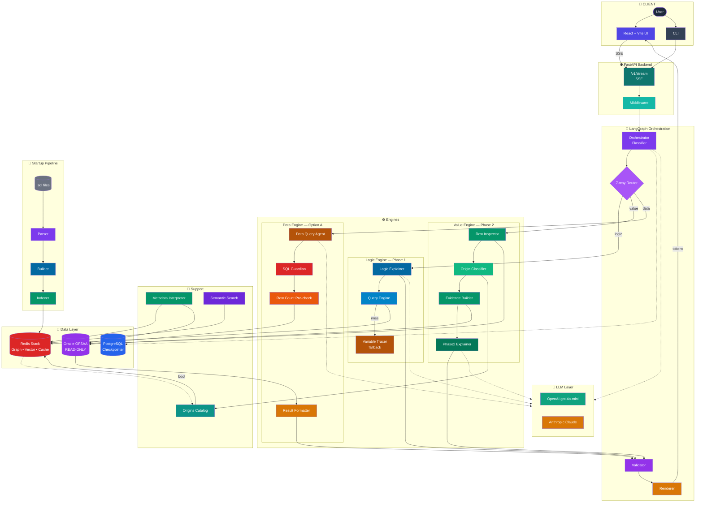

# RTIE — Architecture Overview for Stakeholders

**Regulatory Trace & Intelligence Engine**
*Explain every number. Trace every transformation. Touch nothing.*

---

## 1. What is RTIE, in one paragraph?

RTIE is an AI-powered assistant that sits on top of our Oracle OFSAA regulatory system and answers business and engineering questions about it in plain English. When an analyst or engineer asks *"How is this number calculated?"*, *"Why is this value showing -10 for this account?"*, or *"What is the total exposure for this product line?"*, RTIE reads the actual PL/SQL code and the actual database rows, and returns a fully explained, fully cited answer. It never changes anything — it is strictly read-only. It is designed to be safe enough to use in a regulated BASEL environment, which means it refuses to guess when it doesn't know.

---

## 2. The problem we are solving

Today, whenever a regulatory number looks wrong, a senior engineer has to:

- Open tens of thousands of lines of PL/SQL code
- Manually trace how a column is built, which function touched it, which deduction was applied
- Cross-check with actual data in Oracle
- Cross-check against business rules that only live in people's heads
- Explain all of that back to auditors, regulators, or business users

This typically takes hours or days per question, and the knowledge is concentrated in a few people. RTIE reduces this to seconds, with a full audit trail behind every answer.

---

## 3. What can RTIE answer today?

RTIE supports three capabilities. Every user question is automatically classified into one of these three buckets and routed to the right engine.

| Capability | The question it answers | Example |
|---|---|---|
| **Logic Trace** | *"How is this number built?"* | *"How is N_ANNUAL_GROSS_INCOME calculated?"* |
| **Value Trace** | *"Why is this specific row showing this specific value?"* | *"Why is N_EOP_BAL = -10 for account TF1528012748 on 2025-12-31?"* |
| **Data Query** | *"What does the data currently say?"* | *"What is the total N_EOP_BAL for all ABL accounts on 2025-12-31?"* |

If a question falls outside these three (forecasting, cross-table reconciliation, tables we haven't indexed), RTIE explicitly says so instead of guessing. **A confidently wrong answer is worse than no answer** — that principle drives the entire design.

---

## 4. The system at a glance

RTIE has four main building blocks. A stakeholder can think of it as a layered cake:

1. **The Web App (what users see)** — a chat interface built in React, running in the browser.
2. **The Backend API (the traffic controller)** — a FastAPI server that receives the question, classifies it, and streams the answer back live.
3. **The Three Engines (the brains)** — one for logic questions, one for value questions, one for data questions.
4. **The Data Layer (the sources of truth)** — Oracle OFSAA (read-only), Redis (our fast-access knowledge store), and PostgreSQL (conversation state).

### 4.1 Complete architectural diagram

A fully detailed, colour-coded Mermaid diagram of the entire system lives at [docs/complete-architecture.mmd](complete-architecture.mmd). It shows **every component** in the runtime path, the startup parsing pipeline, the LLM layer, the data layer, and observability. Render it with any Mermaid viewer (GitHub preview, Mermaid Live Editor, VS Code extension).

### 4.2 Simplified block view

```
   ┌──────────────────────┐
   │   Browser: React UI  │   ← user asks a question, sees a live-streaming answer
   └──────────┬───────────┘
              │  (streaming)
   ┌──────────▼───────────┐
   │   FastAPI Backend    │   ← classifies the question, routes to an engine
   └──┬───────┬───────┬───┘
      │       │       │
  ┌───▼──┐┌───▼──┐┌───▼──┐
  │Logic ││Value ││ Data │   ← three specialised engines
  │Engine││Engine││Engine│
  └───┬──┘└───┬──┘└───┬──┘
      │       │       │
  ┌───▼───────▼───────▼───┐
  │  Redis  +  Oracle  +  │   ← data layer (read-only for Oracle)
  │       PostgreSQL      │
  └───────────────────────┘
```

### 4.3 Full system diagram (inline Mermaid)



---

## 5. How a user's question flows through the system

This is the single most important flow to understand. Every question goes through it.

1. **User asks a question** in the chat window.
2. **Classifier** (a small, fast AI call) decides whether this is a logic, value, or data question.
3. **Router** sends it to the matching engine.
4. **Engine** does its work — reads parsed code, or reads actual rows, or generates and runs a safe SELECT.
5. **Explainer** (a second AI call) turns the findings into a readable, cited answer.
6. **Streaming** sends the answer back to the browser word-by-word, so the user sees progress in real time.

The whole round trip, for most questions, is **2–5 seconds**.

---

## 6. The three engines, in plain English

### 6.1 Logic Engine — "How is this number built?"

**The trick:** instead of handing thousands of lines of PL/SQL code to an AI and hoping it understands, RTIE **pre-parses** every PL/SQL function at startup into a compressed "graph" — a structured summary of every INSERT, UPDATE, MERGE, and calculation in the code. A 1,500-line function shrinks to about 290 lines — **an 87% reduction**.

When a logic question arrives, RTIE:

- Looks up *only* the parts of the graph that mention the column the user asked about (this lookup happens in microseconds, directly in Redis).
- Walks backwards through the calculation chain, including fallbacks, overrides, and intermediate variables.
- Sends **only the relevant slice** (2–4 KB) to the AI, together with a prompt that tells it to explain in business language.

**Why this matters for stakeholders:**

- **Cost:** each question costs roughly half a US cent in AI fees, instead of dollars.
- **Accuracy:** the AI cannot hallucinate a function name, because it is only looking at real, parsed code.
- **Speed:** the heavy work is done once at startup; query time is near-instant.

### 6.2 Value Engine — "Why is this row showing this value?"

This engine handles questions about a **specific account on a specific date**. It is the one regulators and reconciliation teams care about most.

The key design decision: **start from the row, not from the code**. A row in the database could have arrived four different ways:

1. Computed by our PL/SQL code (traceable through the graph)
2. Loaded directly from a source system like T24 or IBG (ETL load)
3. Manually uploaded via Excel
4. Produced by a different OFSAA module

The Value Engine fetches the actual row first, reads its `V_DATA_ORIGIN` field (a column Oracle itself populates), and **lets the data tell it which path to trace**. It then:

- Walks the graph path if the value was computed by PL/SQL.
- Identifies the source system if the value was loaded by ETL.
- Surfaces the row facts and recommends an investigation path if the origin is unknown.

It never invents a reason. The AI prompt is explicitly instructed to **forbid** phrases like *"might be because"* or *"possible reasons"*. Every response is then passed through a sanity check that strips any hallucinated function name that isn't in the real graph.

### 6.3 Data Engine — "What does the data currently say?"

This engine is for aggregation, counts, filters, and time-series questions. It generates a SQL SELECT from the user's natural-language question, runs it against Oracle, and formats the answer.

Three safety gates prevent any incident:

1. **SELECT-only Guardian:** every generated SQL is inspected before execution. Any DML (INSERT, UPDATE, DELETE), DDL (CREATE, DROP), or PL/SQL block is rejected.
2. **Row count pre-check:** before returning a list of rows, RTIE first counts how many rows would come back. If more than 10,000 → rejected with a narrowing suggestion. Between 100 and 10,000 → asks the user. Under 100 → executes.
3. **Mandatory row limit:** `FETCH FIRST 100 ROWS ONLY` is auto-appended to any row-listing query.

Time-series queries (e.g., *"compare Dec 2024 vs Dec 2025"*) return both dates explicitly, with clear `no data` placeholders for missing dates — no speculation about why data is missing.

---

## 7. The supporting pieces

### 7.1 Origins Catalog — a map of where data comes from

At startup, RTIE auto-builds a catalog that links `V_DATA_ORIGIN` values (like `T24`, `IBG`, `OF`) to the systems that produced them, plus any hardcoded GL code block lists and value overrides. This catalog is built **by scanning the parsed graph**, not from hand-written rules. **Adding a new module is zero-code**: drop the new `.sql` files in the right folder, restart, and RTIE picks up all new origins automatically.

### 7.2 Variable Tracer — the fallback for rare logic questions

If a logic query can't be matched in the graph index, a fallback engine extracts the relevant 60–80 lines directly from the raw source file and sends them (with tags marking `SEED`, `TRANSFORM`, `COMMENTED_OUT`) to the AI for explanation. This keeps coverage broad without sacrificing the accuracy of the primary graph pipeline.

### 7.3 Streaming — why the UI feels fast

The backend streams the answer to the browser using Server-Sent Events (SSE). The user sees:
- A **pipeline stage indicator** (classifying → tracing → answering)
- **Tokens appearing one by one** as the AI writes
- **Structured metadata** at the end (confidence score, citations, SQL executed, date ranges)

This makes a 3-second response *feel* instant.

---

## 8. Safety — five defensive layers

RTIE is a **read-only system inside a regulated environment**. Safety is enforced at five independent layers, so that no single failure can cause a write.

| Layer | Protection |
|---|---|
| **Database account** | The Oracle service account has SELECT-only privileges. Writing is impossible at the permission level. |
| **SQL Guardian** | Every generated SQL is parsed and rejected if it contains DML, DDL, or PL/SQL. |
| **Bind variables** | All query values go in as named bind parameters. No user input is ever string-concatenated into SQL. |
| **Row limits** | All row-list queries have a hard 100-row cap and a 10,000-row pre-check rejection. |
| **LLM rules** | The value-trace prompt forbids hallucinated function names and speculative language. Responses are sanity-checked against the real graph. |

---

## 9. Technology choices, at a glance

| Layer | Technology | Why |
|---|---|---|
| Frontend | React + Vite + Tailwind CSS | Industry-standard, fast, easy to hire for |
| Backend | Python 3.11 + FastAPI | Strong AI ecosystem, async streaming, type-safe |
| Orchestration | LangGraph | Deterministic, auditable AI pipeline (critical for regulated use) |
| AI Models | OpenAI GPT-4o-mini (default), Anthropic Claude (optional) | Fast, cheap, user-switchable from the UI |
| Knowledge store | Redis Stack (with RediSearch) | Microsecond lookups of the parsed graph and vector search |
| Conversation state | PostgreSQL | LangGraph checkpointer — resumable conversations |
| Database | Oracle (OFSAA FSAPPS, read-only) | The source of truth |

We explicitly chose **LangGraph over AutoGen or CrewAI** because regulated environments need deterministic, traceable workflows, not free-form multi-agent chatter.

---

## 10. What is deliberately out of scope

| Out of scope | Why |
|---|---|
| Any write operations | RTIE is strictly read-only. Everywhere. |
| Forecasting / prediction | RTIE explains what *is*, not what *will be*. |
| Cross-table reconciliation with FCT / results tables | FCT lives in a different schema we haven't parsed yet (roadmap item). |
| Questions about tables not in the parsed scope | The system tells the user, and suggests who owns the data. |
| Speculation about upstream source systems | For ETL-loaded rows, RTIE names the source (e.g., T24) and points to the ETL team — it does not guess why T24 produced a given value. |

---

## 11. How the system scales with new modules

One of the strongest design properties of RTIE is that **adding a new OFSAA module requires zero code changes**:

1. Drop the new PL/SQL files under `db/modules/<NEW_MODULE>/functions/`.
2. Run `python cli.py index --force`.
3. Restart the backend.

The graph is re-parsed, the origins catalog is rebuilt, new `V_DATA_ORIGIN` values and GL codes are picked up automatically, and the new module is live.

---

## 12. Current status

| Milestone | Status |
|---|---|
| **Phase 1** — Logic explanation over parsed PL/SQL graph | Complete |
| **Phase 2** — Value lineage with row-first origin classification | Complete |
| **Option A** — Natural-language data queries with three safety gates | Complete |
| **Test coverage** — 50+ unit tests across parser, builder, classifier, evidence builder, data query | Complete |
| **Web UI** — streaming chat with model selector, slash commands, structured cards | Complete |

---

## 13. What's next (roadmap)

- **Clarification flow in the UI** — when a data query is missing the MIS date, prompt the user inline.
- **Override pattern surfacing** — when a row is not found, proactively suggest known override rules that might explain it.
- **Cross-schema reconciliation** — bring FCT / Results schema into the parsed scope so full reconciliation questions become answerable.
- **Production-scale data integration** — graduate from dev/test datasets to real production volumes with observability via LangSmith.

---

## 14. The bottom line for stakeholders

- **Safe:** read-only, five defensive layers, will not write under any circumstance.
- **Honest:** declines explicitly when it doesn't know, rather than guessing.
- **Fast:** most answers in 2–5 seconds, streaming live.
- **Cheap:** fractions of a cent per question, because the heavy parsing is done once at startup.
- **Maintainable:** new modules are added without code changes.
- **Auditable:** every answer cites the exact function, line range, SQL, and bind parameters that produced it.

RTIE turns a task that used to take a senior engineer hours into a self-service question any business user can ask — without compromising the regulatory-grade accuracy the BASEL environment demands.
